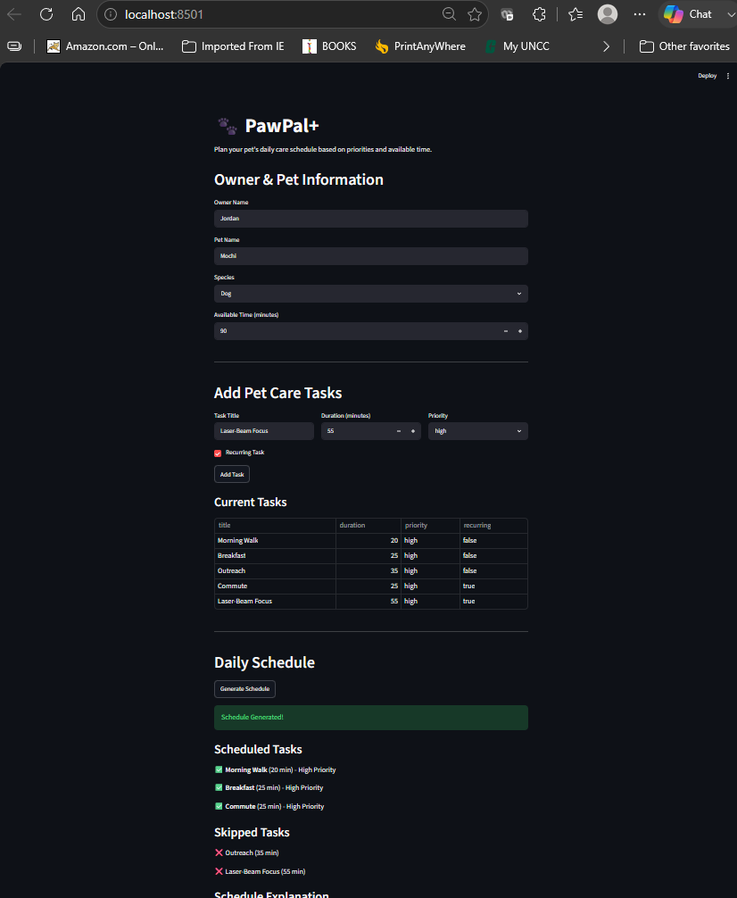

# PawPal+ (Module 2 Project)

You are building **PawPal+**, a Streamlit app that helps a pet owner plan care tasks for their pet.

## Scenario

A busy pet owner needs help staying consistent with pet care. They want an assistant that can:

- Track pet care tasks (walks, feeding, meds, enrichment, grooming, etc.)
- Consider constraints (time available, priority, owner preferences)
- Produce a daily plan and explain why it chose that plan

Your job is to design the system first (UML), then implement the logic in Python, then connect it to the Streamlit UI.

## What you will build

Your final app should:

- Let a user enter basic owner + pet info
- Let a user add/edit tasks (duration + priority at minimum)
- Generate a daily schedule/plan based on constraints and priorities
- Display the plan clearly (and ideally explain the reasoning)
- Include tests for the most important scheduling behaviors

## Getting started

### Setup

```bash
python -m venv .venv
source .venv/bin/activate  # Windows: .venv\Scripts\activate
pip install -r requirements.txt
```

### Suggested workflow

1. Read the scenario carefully and identify requirements and edge cases.
2. Draft a UML diagram (classes, attributes, methods, relationships).
3. Convert UML into Python class stubs (no logic yet).
4. Implement scheduling logic in small increments.
5. Add tests to verify key behaviors.
6. Connect your logic to the Streamlit UI in `app.py`.
7. Refine UML so it matches what you actually built.

## 🖥️ Reproducible Execution Evidence

The CLI demo (`demo.py`) runs the agentic Care Planner on three scenarios and
prints inputs, outputs, confidence scores, health-risk flags, and guardrail
behavior — so the system can be graded without watching a video.

**Command (offline, no API key required — fully reproducible):**

```bash
python demo.py --no-llm
```

With `ANTHROPIC_API_KEY` set, `python demo.py` runs the **live Claude agent**
(plan → act → check → revise → submit); with no key it uses the deterministic
fallback shown below. Both paths produce the same result shape.

**Output:**

```
======================================================================
PawPal+ Care Planner - DETERMINISTIC FALLBACK (no API key / --no-llm)
======================================================================

>>> Scenario 1. Comfortable day (everything fits)
    Available time: 120 min
    Tasks: ['Morning Walk', 'Give Medication', 'Feed Breakfast', 'Play Fetch', 'Brush Coat']
    Engine        : deterministic fallback
    Agent turns   : 0
    Scheduled     : Give Medication, Feed Breakfast, Morning Walk, Play Fetch, Brush Coat
    Skipped       : (none)
    Time used     : 80/120 min
    Confidence    : 1.0
        - Priority-weighted coverage: 12/12 = 1.00
        - All tasks scheduled with no conflicts.
    Explanation   : Baseline plan (no AI): scheduled 5 of 5 tasks by priority then duration, using 80/120 minutes.

>>> Scenario 2. Tight budget (agent must triage)
    Available time: 35 min
    Tasks: ['Give Medication', 'Morning Walk', 'Play Fetch', 'Brush Coat']
    Engine        : deterministic fallback
    Agent turns   : 0
    Scheduled     : Give Medication, Morning Walk
    Skipped       : Play Fetch, Brush Coat
    Time used     : 35/35 min
    Confidence    : 0.6
        - Priority-weighted coverage: 6/9 = 0.67
        - Not every task fit in the available time (time conflict).
    RISK FLAGS    :
        ! Available time is too short for all tasks.
    Explanation   : Baseline plan (no AI): scheduled 2 of 4 tasks by priority then duration, using 35/35 minutes.

>>> Scenario 3. Over-booked (health task at risk)
    Available time: 20 min
    Tasks: ['Long Training Session', 'Vet Appointment', 'Feed Dinner']
    Engine        : deterministic fallback
    Agent turns   : 0
    Scheduled     : Feed Dinner
    Skipped       : Vet Appointment, Long Training Session
    Time used     : 10/20 min
    Confidence    : 0.17
        - Priority-weighted coverage: 3/8 = 0.38
        - Health-critical task(s) skipped: Vet Appointment
        - Not every task fit in the available time (time conflict).
    RISK FLAGS    :
        ! Health-critical task skipped: 'Vet Appointment'
        ! Available time is too short for all tasks.
    Explanation   : Baseline plan (no AI): scheduled 1 of 3 tasks by priority then duration, using 10/20 minutes.

>>> Guardrail check: empty task list
    Rejected as expected: At least one task is required to build a plan.

>>> Guardrail check: negative duration
    Rejected as expected: Task 'Walk' needs a positive integer duration_minutes.
```

**What this evidence demonstrates:**

| Requirement | Where to see it |
|---|---|
| End-to-end run (3 inputs) | Scenarios 1–3, each with input tasks → scheduled/skipped output |
| AI feature behavior | Agentic engine line + `Agent turns`; scenario 2 triages by priority, scenario 3 preserves feeding over a low-value task |
| Reliability / confidence scoring | `Confidence` (1.0 → 0.6 → 0.17) with priority-weighted reasons |
| Guardrails | Health-critical **RISK FLAGS**, plus rejected empty/negative-duration inputs before any AI call |

## 🧪 Testing PawPal+

```bash
# Run the full test suite:
pytest

# Run with coverage:
pytest --cov
```

Sample test output:

```
============================= test session starts =============================
platform win32 -- Python 3.13.2, pytest-9.1.1, pluggy-1.6.0
collected 25 items

tests/test_agent.py ...............                                      [ 60%]
tests/test_scheduler.py ..........                                       [100%]

============================= 25 passed in 0.11s ==============================
```

**Testing summary:** 25 of 25 tests pass. The agent suite covers input
guardrails, scheduler grounding, confidence scoring, health-critical detection,
the offline deterministic fallback, and the agent loop (act → submit) plus the
refusal fallback — all mocked so they run with no API key. The scheduler suite
covers sorting, time-budget filtering, and conflict detection.

## 📐 Smarter Scheduling

> Fill in once you've implemented scheduling logic.


| Feature | Method(s) | Notes |
|---------|-----------|-------|
| Task sorting | `sort_tasks()` | Sorts by priority (high → medium → low), then duration |
| Filtering | `build_schedule()` | Stops adding tasks when time runs out |
| Conflict handling | `detect_conflicts()` | Checks if total task time exceeds available time |
| Recurring tasks | `Task.recurring` | Flag included for future expansion |


## 📸 Demo Walkthrough

Describe your app in numbered steps so a reader can follow along without watching a video:

1. Open the PawPal+ Streamlit app using `py -m streamlit run app.py`
2. Enter owner name, pet name, and species
3. Set available daily time in minutes
4. Add multiple pet care tasks with priority and duration
5. Click “Generate Schedule”
6. View optimized daily plan
7. Review skipped tasks and explanation of scheduling logic

**Screenshot or video** *(optional)*: <!--  -->

