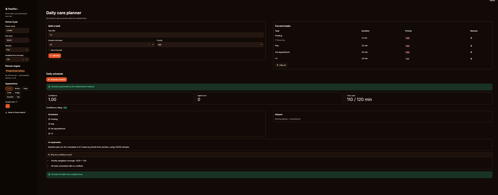
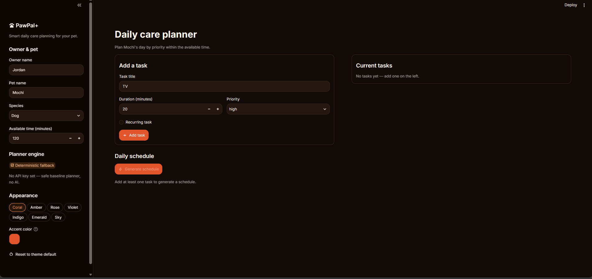

# PawPal+ — Agentic Pet-Care Planner

An applied-AI system that turns a pet owner's daily tasks and available time into
a **safe, prioritized care plan**. An LLM agent reasons about the day, but every
decision is grounded in deterministic scheduling logic — so the plan is both
intelligent *and* verifiable, with confidence scoring and health-safety guardrails.

## Base Project (Modules 1–3)

This project extends **PawPal+**, my Module 2 mini-project: a Streamlit app with an
object-oriented core (`Owner`, `Pet`, `Task`, `Scheduler`) that sorted pet-care
tasks by priority and duration and packed them into the owner's available time,
detecting conflicts when everything wouldn't fit. That prototype was purely
deterministic — it scheduled tasks but could not *reason* about trade-offs or flag
when a skipped task was dangerous.

## What's New in the Final Version

The final system adds an **agentic AI workflow** (the required AI feature) on top of
that verified core:

- **Agentic loop** (`pawpal_agent.py`) — the Claude-powered `CarePlannerAgent`
  runs **plan → act → check → revise → submit**, calling the original `Scheduler`
  as a tool so its plans are always grounded in real logic (not hallucinated).
- **Reliability & guardrails** — input validation before any AI call, a
  **confidence score (0.0–1.0)** with reasons, **health-critical risk flags**
  (e.g. a skipped medication), a safety-refusal handler, and a **deterministic
  fallback** so the app works even with no API key.
- **Logging & traces** — events to `logs/pawpal_agent.log`; agent reasoning traces
  to `ai_interactions.md`.
- **Full integration** — both the Streamlit UI (`app.py`) and the CLI demo
  (`demo.py`) run through the same `plan_care()` entry point.

## Architecture Overview

Data flows **input → guardrails → agentic loop (grounded in the Scheduler) →
confidence scoring → output**, with logging and tests observing the results:

```
Owner tasks + time
   → validate_inputs()            (guardrail: reject bad input)
   → API-key check                (live Claude agent, or deterministic fallback)
   → CarePlannerAgent.plan()      (plan → act → check → revise → submit)
        └─ build_care_schedule → Scheduler.build_schedule()   (source of truth)
   → compute_confidence() + risk flags
   → CarePlanResult               (shown in Streamlit UI / printed by CLI)
```

The full system diagram (required Mermaid source) lives at
[`diagrams/architecture.mmd`](diagrams/architecture.mmd) — preview it at
<https://mermaid.live>. Responsible-AI reflection is in
[`model_card.md`](model_card.md).

## Design decisions

- **The LLM reasons; verified code decides.** The agent never invents a schedule
  — it calls the deterministic `Scheduler` as a tool and the final answer is
  re-grounded in it. This trades some model freedom for trust and reproducibility.
- **Fails safe, not loud.** Bad input is rejected before any AI call, and with no
  API key the app runs a deterministic fallback instead of erroring — so it works
  and is gradeable offline.
- **Confidence over false certainty.** Every plan carries a 0–1 score and explicit
  health-risk flags rather than presenting one unqualified answer.
- **Native theming, scoped CSS.** The UI theme is configured natively via
  [`.streamlit/config.toml`](.streamlit/config.toml) (colors, fonts, light/dark),
  which is cleaner and upgrade-safe. The one deliberate exception is the live
  accent-color picker: it applies a small, tightly-scoped CSS override (primary
  buttons and links only) because runtime color switching isn't possible through
  config alone.

## Getting started

### Setup

```bash
python -m venv .venv
source .venv/bin/activate  # Windows: .venv\Scripts\activate
pip install -r requirements.txt
```

**Optional — enable the live Claude agent.** The system runs fully offline using
its deterministic fallback, so no key is required to run or grade it. To exercise
the live agentic loop, set your Anthropic API key:

```bash
export ANTHROPIC_API_KEY=sk-...   # Windows PowerShell: $env:ANTHROPIC_API_KEY="sk-..."
```

### Running

```bash
# CLI demo — reproducible evidence across 3 scenarios (offline)
python demo.py --no-llm

# CLI demo — live Claude agent (requires ANTHROPIC_API_KEY)
python demo.py

# Streamlit UI
streamlit run app.py      # or: py -m streamlit run app.py

# Tests
pytest
```

## 🖥️ Reproducible Execution Evidence

The CLI demo (`demo.py`) runs the agentic Care Planner on three scenarios and
prints inputs, outputs, confidence scores, health-risk flags, and guardrail
behavior — so the system can be graded without watching a video.

**Command (offline, no API key required — fully reproducible):**

```bash
python demo.py --no-llm
```

With `ANTHROPIC_API_KEY` set, `python demo.py` runs the **live Claude agent**
(plan → act → check → revise → submit); with no key it uses the deterministic
fallback shown below. Both paths produce the same result shape.

**Output:**

```
======================================================================
PawPal+ Care Planner - DETERMINISTIC FALLBACK (no API key / --no-llm)
======================================================================

>>> Scenario 1. Comfortable day (everything fits)
    Available time: 120 min
    Tasks: ['Morning Walk', 'Give Medication', 'Feed Breakfast', 'Play Fetch', 'Brush Coat']
    Engine        : deterministic fallback
    Agent turns   : 0
    Scheduled     : Give Medication, Feed Breakfast, Morning Walk, Play Fetch, Brush Coat
    Skipped       : (none)
    Time used     : 80/120 min
    Confidence    : 1.0
        - Priority-weighted coverage: 12/12 = 1.00
        - All tasks scheduled with no conflicts.
    Explanation   : Baseline plan (no AI): scheduled 5 of 5 tasks by priority then duration, using 80/120 minutes.

>>> Scenario 2. Tight budget (agent must triage)
    Available time: 35 min
    Tasks: ['Give Medication', 'Morning Walk', 'Play Fetch', 'Brush Coat']
    Engine        : deterministic fallback
    Agent turns   : 0
    Scheduled     : Give Medication, Morning Walk
    Skipped       : Play Fetch, Brush Coat
    Time used     : 35/35 min
    Confidence    : 0.6
        - Priority-weighted coverage: 6/9 = 0.67
        - Not every task fit in the available time (time conflict).
    RISK FLAGS    :
        ! Available time is too short for all tasks.
    Explanation   : Baseline plan (no AI): scheduled 2 of 4 tasks by priority then duration, using 35/35 minutes.

>>> Scenario 3. Over-booked (health task at risk)
    Available time: 20 min
    Tasks: ['Long Training Session', 'Vet Appointment', 'Feed Dinner']
    Engine        : deterministic fallback
    Agent turns   : 0
    Scheduled     : Feed Dinner
    Skipped       : Vet Appointment, Long Training Session
    Time used     : 10/20 min
    Confidence    : 0.17
        - Priority-weighted coverage: 3/8 = 0.38
        - Health-critical task(s) skipped: Vet Appointment
        - Not every task fit in the available time (time conflict).
    RISK FLAGS    :
        ! Health-critical task skipped: 'Vet Appointment'
        ! Available time is too short for all tasks.
    Explanation   : Baseline plan (no AI): scheduled 1 of 3 tasks by priority then duration, using 10/20 minutes.

>>> Guardrail check: empty task list
    Rejected as expected: At least one task is required to build a plan.

>>> Guardrail check: negative duration
    Rejected as expected: Task 'Walk' needs a positive integer duration_minutes.
```

**What this evidence demonstrates:**

| Requirement | Where to see it |
|---|---|
| End-to-end run (3 inputs) | Scenarios 1–3, each with input tasks → scheduled/skipped output |
| AI feature behavior | Agentic engine line + `Agent turns`; scenario 2 triages by priority, scenario 3 preserves feeding over a low-value task |
| Reliability / confidence scoring | `Confidence` (1.0 → 0.6 → 0.17) with priority-weighted reasons |
| Guardrails | Health-critical **RISK FLAGS**, plus rejected empty/negative-duration inputs before any AI call |

## 🧪 Testing PawPal+

```bash
# Run the full test suite:
pytest

# Run with coverage:
pytest --cov
```

Sample test output:

```
============================= test session starts =============================
platform win32 -- Python 3.13.2, pytest-9.1.1, pluggy-1.6.0
collected 25 items

tests/test_agent.py ...............                                      [ 60%]
tests/test_scheduler.py ..........                                       [100%]

============================= 25 passed in 0.11s ==============================
```

**Testing summary:** 25 of 25 tests pass. The agent suite covers input
guardrails, scheduler grounding, confidence scoring, health-critical detection,
the offline deterministic fallback, and the agent loop (act → submit) plus the
refusal fallback — all mocked so they run with no API key. The scheduler suite
covers sorting, time-budget filtering, and conflict detection.

## 📐 Scheduling Core (source of truth)

The agent never invents a schedule — it calls this verified logic from
`pawpal_system.py` as a tool and grounds every plan in the result:

| Feature | Method(s) | Notes |
|---------|-----------|-------|
| Task sorting | `sort_tasks()` | Sorts by priority (high → medium → low), then duration |
| Filtering | `build_schedule()` | Stops adding tasks when time runs out |
| Conflict handling | `detect_conflicts()` | Checks if total task time exceeds available time |
| Recurring tasks | `Task.recurring` | Flag included for future expansion |

## 📸 Demo Walkthrough

To see the full agentic system end-to-end in the Streamlit UI:

1. Launch the app: `streamlit run app.py` (or `py -m streamlit run app.py`).
2. Enter owner name, pet name, and species.
3. Set available daily time in minutes.
4. Add pet-care tasks with a priority and duration (include a `Medication` or
   `Vet` task to trigger the health-safety guardrail).
5. Click **Generate Schedule**. A banner shows whether the live Claude agent or
   the deterministic fallback is running.
6. Review the plan: **Confidence** score, **Agent turns**, **Time Used**, any
   **health risk flags**, the AI **explanation**, and a "Why this confidence
   score?" breakdown.
7. See the reproducible CLI evidence above (`python demo.py --no-llm`) for the
   same behavior without the UI.

**Screenshots:**

*Full app view — a comfortable day where all four tasks fit: the planner
schedules everything within the available time and reports confidence 1.00.*



*Input view — owner/pet details and the task builder.*



## 🧠 Responsible-AI Reflection

The graded reflection — AI collaboration (one helpful and one flawed suggestion),
limitations and biases, misuse prevention, and reliability-testing surprises —
lives in [`model_card.md`](model_card.md).
